

# Hello! I'm Vishnu D.

### Full-Stack Developer building React & Next.js apps and reusable UI systems focused on maintainability and DX.

 

<a href="mailto:vishnu.d.t.2004@gmail.com">
 <picture>
    <source media="(prefers-color-scheme: dark)" srcset="./assets/icons/social/email_dark.svg" />
    <source media="(prefers-color-scheme: light)" srcset="./assets/icons/social/email_light.svg" />
    
 </picture>
</a>
<a href="https://vishnudt2004.github.io/vishnud-resume/vishnud-resume-fullstack.pdf">
 <picture>
    <source media="(prefers-color-scheme: dark)" srcset="./assets/icons/social/resume_dark.svg" />
    <source media="(prefers-color-scheme: light)" srcset="./assets/icons/social/resume_light.svg" />
    
 </picture>
</a>
<a href="https://portfolio-vishnud.vercel.app/">
 <picture>
    <source media="(prefers-color-scheme: dark)" srcset="./assets/icons/social/portfolio_dark.svg" />
    <source media="(prefers-color-scheme: light)" srcset="./assets/icons/social/portfolio_light.svg" />
    
 </picture>
</a>
<a href="https://linkedin.com/in/vishnu-dt">
 <picture>
    <source media="(prefers-color-scheme: dark)" srcset="./assets/icons/social/linkedin_dark.svg" />
    <source media="(prefers-color-scheme: light)" srcset="./assets/icons/social/linkedin_light.svg" />
    
 </picture>
</a>
<a href="https://github.com/vishnudt2004/">
 <picture>
    <source media="(prefers-color-scheme: dark)" srcset="./assets/icons/social/github_dark.svg" />
    <source media="(prefers-color-scheme: light)" srcset="./assets/icons/social/github_light.svg" />
    
 </picture>
</a>
<a href="https://leetcode.com/vishnud2004">
 <picture>
    <source media="(prefers-color-scheme: dark)" srcset="./assets/icons/social/leetcode_dark.svg" />
    <source media="(prefers-color-scheme: light)" srcset="./assets/icons/social/leetcode_light.svg" />
    
 </picture>
</a>
<a href="https://www.hackerrank.com/profile/vishnu_d_t_2004">
 <picture>
    <source media="(prefers-color-scheme: dark)" srcset="./assets/icons/social/hackerrank_dark.svg" />
    <source media="(prefers-color-scheme: light)" srcset="./assets/icons/social/hackerrank_light.svg" />
    
 </picture>
</a>

---

 
 

## 📌 About Me

I'm a **Full-Stack Developer** focused on **React, Next.js, and TypeScript**, building scalable web applications with clean architecture, reusable UI systems, and long-term maintainability in mind.

**Core Stack**  
**Frontend**: React, Next.js, TypeScript, Tailwind CSS  
**Backend**: Node.js, Express, MongoDB, PostgreSQL

- Built **SUIC (Simple-UI Components)** — a local-first UI system with CLI-based installation inspired by shadcn/ui, focused on modular architecture and developer workflow efficiency.
- Design REST APIs with a structured backend architecture, emphasizing scalability and maintainability.
- Continuously refine project structure, documentation clarity, and reusable component patterns across repositories.

 
 

## 🚀 Projects

Here are selected projects:

| Project                           | Description                                                                                                                         | Links                                                                                                       |
| --------------------------------- | ----------------------------------------------------------------------------------------------------------------------------------- | ----------------------------------------------------------------------------------------------------------- |
| **SUIC - Simple UI Components**   | Lightweight, reusable React/Next.js components with CLI installation and documentation system. Get started with: `npx suic-cli`     | [Docs](https://suic-docs.vercel.app/) / [GitHub](https://github.com/vishnudt2004/suic-core)                 |
| **Globblog - Blog application**   | A full-featured blog application built with the MERN stack, allowing users to create and manage posts and customize their profiles. | [Live](https://globblog.vercel.app/) / [GitHub](https://github.com/vishnudt2004/globblog)                   |
| **Personal Portfolio - Vishnu D** | A personal portfolio website showcasing my skills, projects, and journey as a developer.                                            | [Live](https://portfolio-vishnud.vercel.app/) / [GitHub](https://github.com/vishnudt2004/portfolio-vishnud) |

- ### SUIC - Simple UI Components
  - 

    
<b>Screenshot</b> (Hero section)

       
      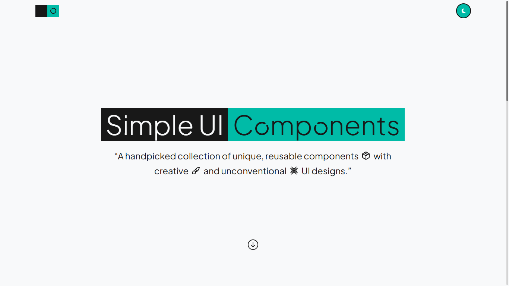
    

  - **Technologies Used:** Next.js, TypeScript, MDX, Tailwind CSS, Framer Motion, React, Node.js, and more!

- ### Globblog - Blog application
  - 

    
<b>Screenshot</b> (Hero section)

       
      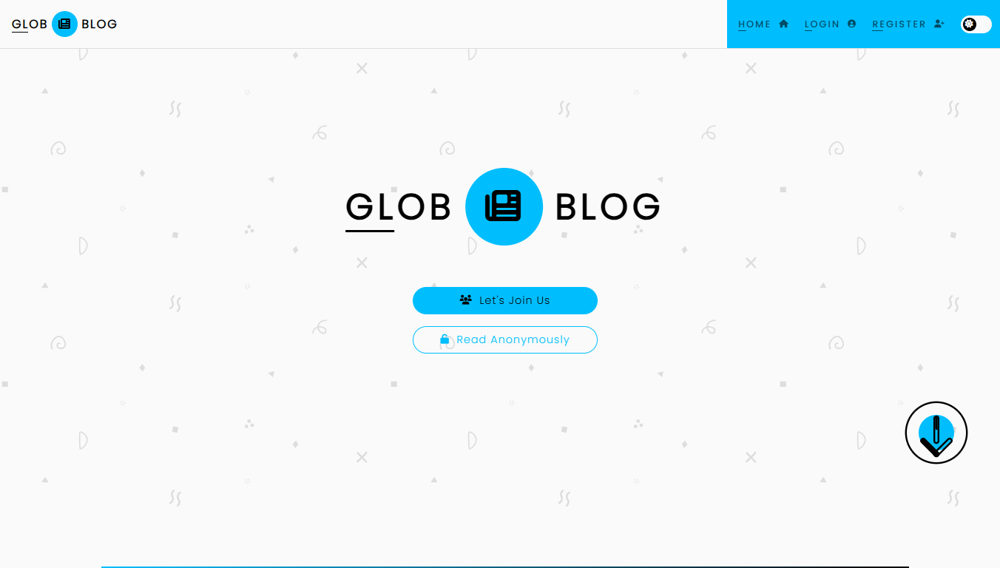
    

  - **Technologies Used:** React, Node.js, Express, MongoDB, Redux, Mongoose, Quill.js, JWT, Google OAuth 2.0, React Router, Styled Components

- ### Personal Portfolio - Vishnu D
  - 

    
<b>Screenshot</b> (Hero section)

       
      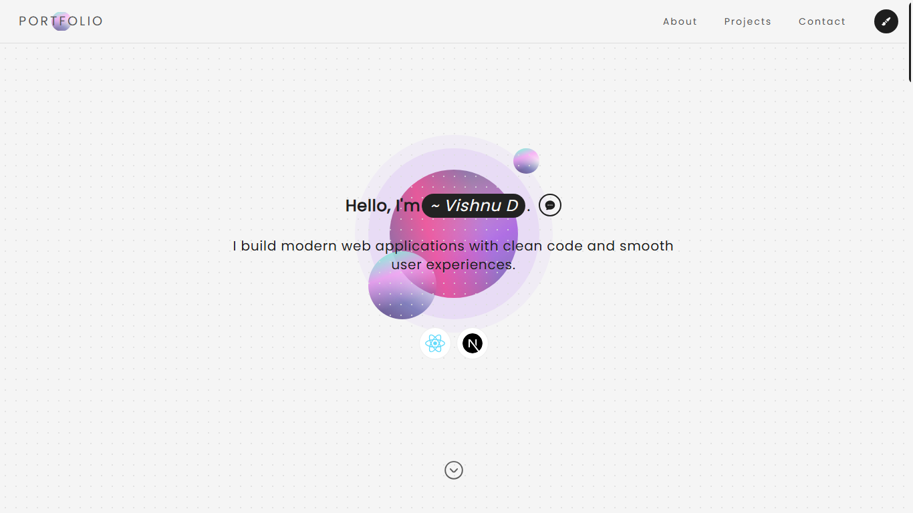
    

  - **Technologies Used:** React, Tailwind CSS, Framer Motion

 
 

## 🧰 Tech Stack & Tools

- **Core**:

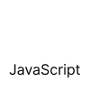&nbsp;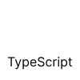&nbsp;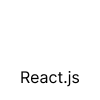&nbsp;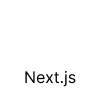&nbsp;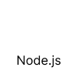&nbsp;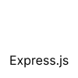

- **Databases**:

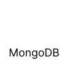&nbsp;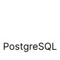

- **Libraries & Frameworks**:

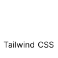&nbsp;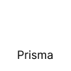&nbsp;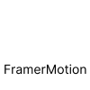

- **Tools & Workflow**:

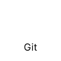&nbsp;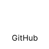&nbsp;&nbsp;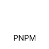&nbsp;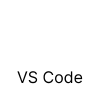&nbsp;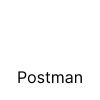&nbsp;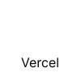&nbsp;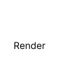

 
 

## 🎓 Education

- ### B.Sc. in Computer Science (2021–2024)

  Government Arts and Science College, Komarapalayam  
  Affiliated to Periyar University, Salem  
  CGPA: 6.7 / 10 — First Class (A+)

- ### M.Sc. in Computer Science (2024–2026)

  Government Arts and Science College, Komarapalayam  
  Affiliated to Periyar University, Salem

<!--  
 

## 📊 GitHub Stats & Activity

- **GitHub Stats**:
   
  

- **Top Languages**:
   
  

- **GitHub Streak**:
   
  

- **GitHub Contribution Graph**:
   
  

- **LeetCode Stats**:
   
  

- [My Open Source Contributions](https://my-open-source-contributions.vercel.app/vishnudt2004)

 -->

 
 
 

---

  
<b>Thanks for visiting.</b>

  

    <a href="https://portfolio-vishnud.vercel.app/">Portfolio</a> • 
    <a href="mailto:vishnu.d.t.2004@gmail.com">Email</a>
  

---
